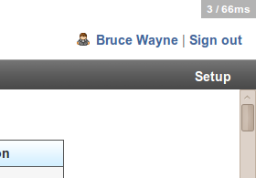
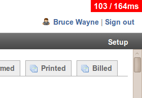

<p>
  <a href="https://makandra.de/">
    <picture>
      <source media="(prefers-color-scheme: light)" srcset="media/makandra-with-bottom-margin.light.svg">
      <source media="(prefers-color-scheme: dark)" srcset="media/makandra-with-bottom-margin.dark.svg">
      
    </picture>
  </a>

  <picture>
    <source media="(prefers-color-scheme: light)" srcset="media/logo.light.shapes.svg">
    <source media="(prefers-color-scheme: dark)" srcset="media/logo.dark.shapes.svg">
    
  </picture>
</p>

[](https://github.com/makandra/query_diet/actions)


Query Diet counts the number of database queries for the last request and *subtly* displays it in the upper right corner of your screen.
The display turns red if too many queries are run, or if they take too long.
This is useful to prevent [N + 1 queries](http://guides.rubyonrails.org/active_record_querying.html#eager-loading-associations) from creeping into your code.

This is Query Diet being happy about 3 requests taking 66ms:



This is Query Diet being angry about 103 requests taking 164ms:




Installation
------------

Add it to your Gemfile with

```Ruby
gem 'query_diet', group: :development
```

Now add the widget to your application layout, like

```Erb
# app/views/layout/application.html.erb
# ...
<body>
  <%= query_diet_widget if Rails.env.development? %>
  <%= yield %>
</body>
```
   
We recommend you only use the gem with the development environment.

### Changing warning thresholds

You can define when the counter turns into a red warning. The default threshold is 8 queries and 5000 miliseconds.
To change the default, simply pass them to the `query_diet_widget` helper:

```Erb
<%= query_diet_widget(:bad_count => 4, :bad_time => 2000) %>
```

### Content Security Policy

You can pass whether to use a nonce for style and script tags.
Note that the key must be a symbol like in the example below, otherwise it defaults to `false`.

```Erb
<%= query_diet_widget(:nonce => true) if Rails.env.development? %>
```

In your content security policy initializer of the project you should set the nonce to those directives:
```Erb
Rails.application.config.content_security_policy_nonce_directives = %w[script-src style-src]
```

When you do not want to use a nonce, but use a style tag, for example, you could use `unsafe_inline`:
```Erb
Rails.application.config.content_security_policy do |policy|
  policy.style_src   :self, :unsafe_inline
```

### Rails compatibility

The gem is tested against

| Versions  |     Ruby 2.7.8     |     Ruby 3.0.0     |     Ruby 3.1.6     |     Ruby 3.3.4     |     Ruby 3.4.4     |
|-----------|:------------------:|:------------------:|:------------------:|:------------------:|:------------------:|
| Rails 6.1 | :heavy_check_mark: | :heavy_check_mark: | :heavy_check_mark: |        :x:         |        :x:         |
| Rails 7.0 | :heavy_check_mark: | :heavy_check_mark: | :heavy_check_mark: | :heavy_check_mark: |        :x:         |
| Rails 7.1 |        :x:         |        :x:         | :heavy_check_mark: | :heavy_check_mark: |        :x:         |
| Rails 7.2 |        :x:         |        :x:         | :heavy_check_mark: | :heavy_check_mark: |        :x:         |
| Rails 8.0 |        :x:         |        :x:         |        :x:         | :heavy_check_mark: |        :x:         |
| Rails 8.1 |        :x:         |        :x:         |        :x:         | :heavy_check_mark: | :heavy_check_mark: |


Later versions might work, earlier will not.

For Rails 2.3 and Ruby 1.8.7 support, use a version < 0.6.


Credits
-------

[Henning Koch](https://github.com/henning-koch)

[Tobias Kraze](https://github.com/kratob)

[makandra.com](http://makandra.com/)

[gem-session.com](http://gem-session.com/)

[Michael Grosser](https://github.com/grosser)
